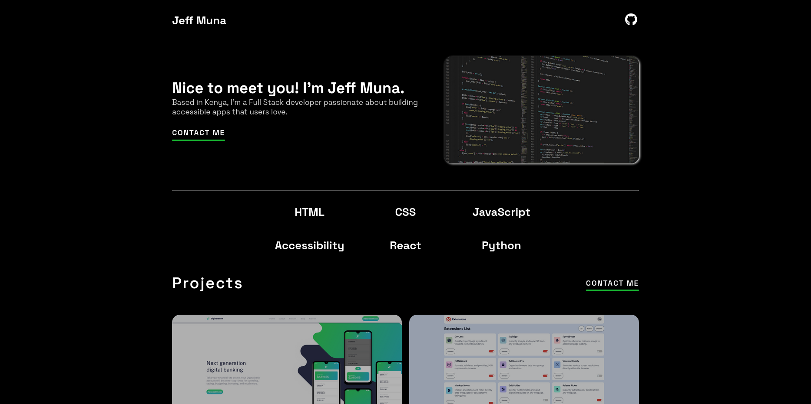
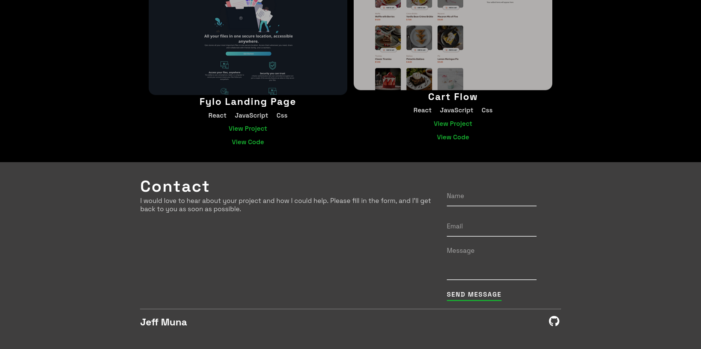

# Portfolio website

## Table of contents

- [Overview](#overview)
- [Screenshot](#screenshot)
- [Links](#links)
- [Built with](#built-with)
- [Continued development](#continued-development)
- [Author](#author)

## 📌 Overview

- You created a personal portfolio website that introduces you as a developer, showcases your projects, and provides a way for visitors to contact you. The site has a modern, responsive layout and a clean design with smooth interactions.

- **Header** with your name and a GitHub link (SVG logo included).

- **Intro** section with your photo, a headline, and a call-to-action button.

- **Tech** stack section listing the languages and tools you use.

- **Projects** section displaying your key work with links to live demos and GitHub repos.

- **Contact** section with a form for users to reach you.
- **
- **Footer** repeating your branding and GitHub link.

## Screenshot

- 

- 

## Links
- **Repo Link**: [Clike me!](https://github.com/JeffM20501/Portfolio)

- **Live site**: [Click me!](https://jeffmunaportfolio.netlify.app/)

## Built With

- **HTML5**  Semantic structure (``header``, ``main``, `section`, `footer`, `article`).
 
- **CSS3**  Variables (`--hColor`, `--buttonBG`), flexbox, grid, responsive media queries, hover effects, transitions, and custom styling.
 
- **JavaScript**:  Scroll behavior for "Contact Me" buttons (`scrollIntoView` with smooth animation).
 
- **Google Fonts**: `Space Grotesk` for modern typography.

- **Netlify**: For deployment and hosting.

## Features Implemented

- Responsive layout:  Works across desktop and smaller screens using media queries.

- Smooth scroll:  Contact button scrolls directly to the form.

- SVG icon styling:  GitHub logo is scalable, color-inherits, and animated on hover.

- Interactive hover states:  Buttons, project images, and links respond with color and scale transitions.

- Clean project showcase: Each project has a screenshot, title, description, and links.

## Continued development
-  Include **meta describtion** for better search engine visibility
- Optimize and compress images for faster page loading

## Author

- **Jeff Muna**